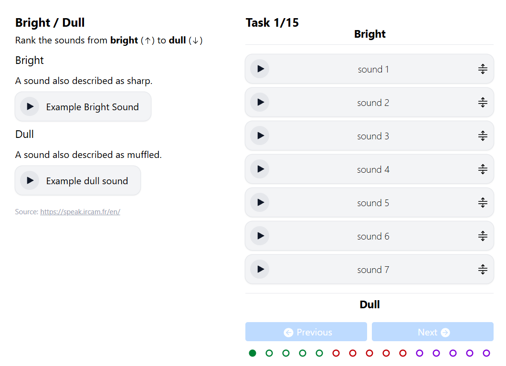
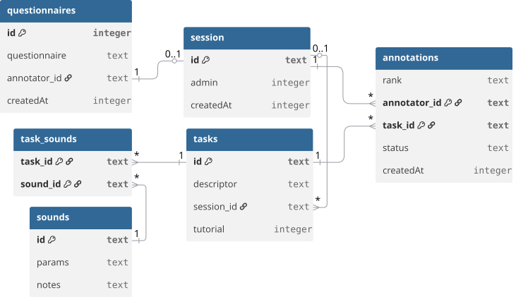

# TimbreSynth

## Development

Before starting the development environment you must create a `.env.local` file with the following fields:

```dotenv
SIGNUP_KEY=  # If set, requires a key to access the signup page (e.g. https://localhost:4513/signup?key=<key>)
ADMIN_PASSWORD=  # If not set, access to admin routes is blocked
CF_TURNSTILE_SECRET=  # Required to submit annotations
```

To start the application locally run the following command.

```
pnpm run dev
```

### Synchronized presentation embeds

Two same-origin embeds can mirror the interface through a `BroadcastChannel`. Give both embeds the
same `sync` identifier and assign one of them the controller role:

```text
https://timbre.jessseee.nl/en/?sync=thesis&role=controller
https://timbre.jessseee.nl/en/?sync=thesis&role=display
```

The controller publishes synth patches, sequencer notes, task completion, task navigation, and
playback progress. The display mirrors the playing state and active sequencer step but is read-only.
It runs a zero-gain copy of the synth for its local waveform analyser, so only the controller produces
audible output. A newly opened display requests the controller's current state automatically.
`BroadcastChannel` only connects browsing contexts on the same origin and in the same browser storage
partition.

Give presentation iframes `allow="autoplay"` so the display's muted Web Audio graph is permitted to
run its analyser without a direct click inside that iframe.

The same query parameters also synchronize two standalone `/synth` routes with each other.

### Cloudflare

This application is build to deploy to Cloudflare. You can use `pnpm run preview` to build and run the application locally using `miniflare` to simulate running on a Cloudflare Worker with a D1 database and an R2 storage bucket.

## Implementation

### Synthesizer

The main part of this application is a synthesizer module build with [Tone.js](https://tonejs.github.io) to run in the browser. The synthesizer implementation can be found in [Synth.ts](src/lib/frontend/Synth.ts). On the page `/admin/synth` you will find a module to play sounds with different parameters and store them to the database, to create a dataset for annotation. Once you have created the desired number of sounds you can let the application generate annotation tasks.

### Annotation tool

The annotation tool lets users rank the sounds by timbre descriptors. The resulting annotations can then be combined using a [Plackett-Luce model](https://cran.rstudio.com/web/packages/PlackettLuce/vignettes/Overview.html) to create scores for each of the timbre descriptors relative to the rest of the dataset (e.g. whether one sound is _brighter_ than another).

#### Example of the annotation interface



### Database schema

Database schema generated from [DBML](https://dbml.dbdiagram.io/home) using [dbdiagram.io](https://dbdiagram.io).


